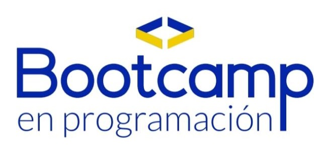

<!-- Banner -->
<p align="center">
  
</p>

# 🚀 Bootcamp en Programación

Bienvenido/a al repositorio del **Bootcamp en Programación**.  
Aquí encontrarás todos los recursos, ejercicios y proyectos que iremos desarrollando durante el curso.

---

## 📂 Estructura del Repositorio
```yaml
📦 bootcamp
├── 📁 pruebas                 # Pruebas de estructuras de código PHP y HTML
│   ├── pruebaHTML
│   ├── pruebaPHP
│   └── ...
├── 📁 ejercicios              # Carpeta con ejercicios por día
│   ├── dia_01
│   ├── dia_02
│   └── ...
├── 📁 SistemaGT               # Seguimiento de proyecto desarrollado durante el bootcamp
│   ├── 📁 public/
│   │   └── ...
│   ├── 📁 includes/
│   │   └── ...
│   └── ...
├── 📁 docs
│   └── apuntes.md             # Documentación y apuntes del bootcamp
└── README.md


---

## 📌 Contenido

- **pruebas/** → Pruebas de estructuras de código PHP y HTML.  
- **ejercicios/** → Ejercicios prácticos organizados por día.  
- **SistemaGT/** → Seguimiento de proyecto desarrollado durante el bootcamp.  
- **docs/** → Documentación, teoría y apuntes.  

---

## 🛠️ Tecnologías Usadas

- **PHP** (backend)  
- **HTML, CSS, JavaScript** (frontend)  
- **PostgreSQL** (base de datos)  
- Arquitectura **MVC**  
- Librerías externas:  
  - **Leaflet.js** (para mapas)  
  - **FPDF** o **PhpSpreadsheet** (para exportar reportes)  

---

## 👥 Autor / Equipo

Facilitadores del **Bootcamp PreHackathon Occidente**

